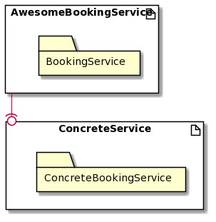
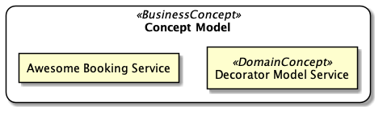
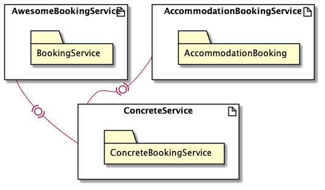
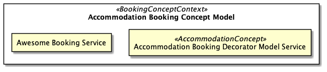

# Getting Started

**Awesome Booking Service** started as a small *endeavor*, that sought 
to demonstrate:

- how one write *specs* for *Concrete Classes*
- *verify* that implementation can actually **fulfil** business needs

!!! info "Code Repository"

    Source code associated with this Chapter can be found at [github](https://github.com/ahmednafies/sanic_camelcase_middleware).

The *main* objective was to document a process in a manner that was already 
demonstrated(see DesignPatternsPHP).

------------------

`luyandasiko in desktop-app $ mkdir awesome-works `

------------------

At this point we have just configured our **workspace** from which 
we will work from and below is a modular view of our *approach*.



!!! warning "Architectural Smell"

    `BookingService` suggests that `AccommodationBookingService` can optionally 
    depend on it.

It is important, in Agile, to timeously revisit your *business model* if 
it is improving.



## Architectural Review

The ability to build a model that you believe works than what actually 
does is one thing.



There seems to be a **hard dependency** in our code-base no matter we think 
our **Code Quality** is *Flexible*. The **Decorator Pattern** allows for this 
already.

## Test Cases

As just *proof* with no proper business value messure *bookable* `item`, 
lets `book` it.

### PHPSpec Coverage

!!! danger "What is PHPSpec?"

    `PHPSPEC` ....

It is important, in Agile, to timeously revisit your *business model*, to check if 
it is improving or not.

```bash
luyandasiko in awesome-booking-service -> feature/automated_acceptance_test_integration [?$]
$ vendor/bin/phpspec run

      DigitalClosuxe\Awesome\Service\BookingService\Accommodation\Line\AdditionalBed

  24  ✔ is initializable (79ms)
  29  ✔ is a booking service
  34  ✔ has an accumulated price
  39  ✔ has extra bed description

      DigitalClosuxe\Awesome\Service\BookingService\Accommodation\Line\HotspotWifi

  24  ✔ is initializable
  29  ✔ is a booking service
  34  ✔ has an accumulated price
  39  ✔ has wifi description

      DigitalClosuxe\Awesome\Service\BookingService\Type\AccommodationBooking

  11  ✔ is initializable
  16  ✔ is a booking service type
  21  ✔ has a standard price
  26  ✔ has description


3 specs
12 examples (12 passed)
88ms
```

### Unit Testing Coverage

```bash
luyandasiko in awesome-booking-service -> feature/automated_acceptance_test_integration [?$]
$ vendor/bin/phpunit
PHPUnit 9.2.6 by Sebastian Bergmann and contributors.

Runtime:       PHP 7.4.8
Configuration: /Users/luyandasiko/awesome-works/awesome-booking-service/phpunit.xml

.......                                                             7 / 7 (100%)

Time: 00:00.048, Memory: 6.00 MB

OK (7 tests, 20 assertions)
```

!!! alert "Look out for Gherkin, it is a powerful *language*?"

```gherkin
luyandasiko in awesome-booking-service -> feature/automated_acceptance_test_integration [?$]
$ vendor/bin/behat
Feature: Standard Price Accommodation booking
  
  As a Software Engineer
  I want to ensure that the Booking Service calculates prices
  So that I can verify the correctness of my solution

  Scenario: Calculate Standard Price booking                                                      # features/bootstrap/booking_services/accommodation_bookings_service.feature:7
    Given I have a "DigitalClosuxe\Awesome\Service\BookingService\BookingService" booking Service # FeatureContext::iHaveABookingService()
    And I check the Booking Service price                                                         # FeatureContext::iCheckTheBookingServicePrice()
    Then the Booking Price should equal "40"                                                      # FeatureContext::theBookingPriceShouldEqual()

  Scenario: Calculate Standard Price booking with Hotspot Wifi                                    # features/bootstrap/booking_services/accommodation_bookings_service.feature:12
    Given I have a "DigitalClosuxe\Awesome\Service\BookingService\BookingService" booking Service # FeatureContext::iHaveABookingService()
    And I add Wifi Hotspot as an extra to my booking                                              # FeatureContext::iAddWifiHotspotAsAnExtraToMyBooking()
    Then the Booking Price should equal "42"                                                      # FeatureContext::theBookingPriceShouldEqual()

  Scenario: Calculate Standard Price booking with extra Bed                                       # features/bootstrap/booking_services/accommodation_bookings_service.feature:17
    Given I have a "DigitalClosuxe\Awesome\Service\BookingService\BookingService" booking Service # FeatureContext::iHaveABookingService()
    And I add an extra Bed as an extra to my booking                                              # FeatureContext::iAddAnExtraBedAsAnExtraToMyBooking()
    Then the Booking Price should equal "70"                                                      # FeatureContext::theBookingPriceShouldEqual()

  Scenario: Calculate Standard Price booking with Hotspot Wifi and extra Bed                      # features/bootstrap/booking_services/accommodation_bookings_service.feature:22
    Given I have a "DigitalClosuxe\Awesome\Service\BookingService\BookingService" booking Service # FeatureContext::iHaveABookingService()
    And I add Wifi Hotspot and a Bed as an extra to my booking                                    # FeatureContext::iAddWifiHotspotAndABedAsAnExtraToMyBooking()
    Then the Booking Price should equal "72"                                                      # FeatureContext::theBookingPriceShouldEqual()

4 scenarios (4 passed)
12 steps (12 passed)
0m0.10s (9.75Mb)

```

### Solution Design

It turns out that, if we `spec` an implementation we afford ourselves 
an opportunity to *refinement*. Let us imagine the class implementation 
for a typyical `AccommodationBookingService`

## Development Pipeline as a **Process Task**

Each **Software Engineer** should be able to create a **Request for Proposal** 
Report Document for **Sprint Planning Review**.

